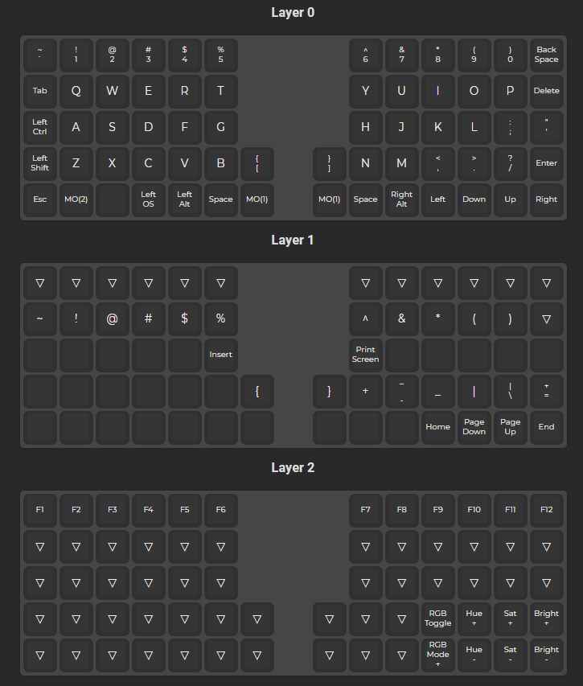

# helix

## building

- [keyboard soldering](https://github.com/MakotoKurauchi/helix/blob/master/Doc/buildguide_en.md)

## firmware

You can either use the online builder [here](https://config.qmk.fm/#/helix/rev3_5rows/LAYOUT) or you can compile it yourself

Follow [this](https://docs.qmk.fm/#/getting_started_build_tools) guide to install all the necessary stuff you need to compile

This guide is a TL;DR of the above, I suggest to use this after reading the whole docs at least once

All files can be found here:
- windows: `C:\Users\YOURUSER\qmk_firmware\keyboards\helix\keymaps\YOURLAYOUT`

### new keymap
`qmk new-keymap -kb helix/rev3_5rows`

There are 3 files that can be edited:
- `keymap.c`: contains the layouts, you can copy mine or make your own
- `config.h`: contains defines for RGBLED and other stuff
- `rules.mk`: contains a list of feature to enable or disable

### compile
`qmk compile -kb helix/rev3_5rows -km <keymap>`

This will compile the firmware, resulting in a `.hex` file

### flashing
`qmk flash`

Alternatively you can use the QMK Tool to flash

### c to json
`qmk c2json -kb helix/rev3_5rows -km <keymap> -o output.json /path/to/keymap.c`

Creates a `.json` file to import on the online configurator

I use this to print the layout like in the picture below

Once you import the json in the online configurator you can click on "Print Keymap"
    

## current layout

