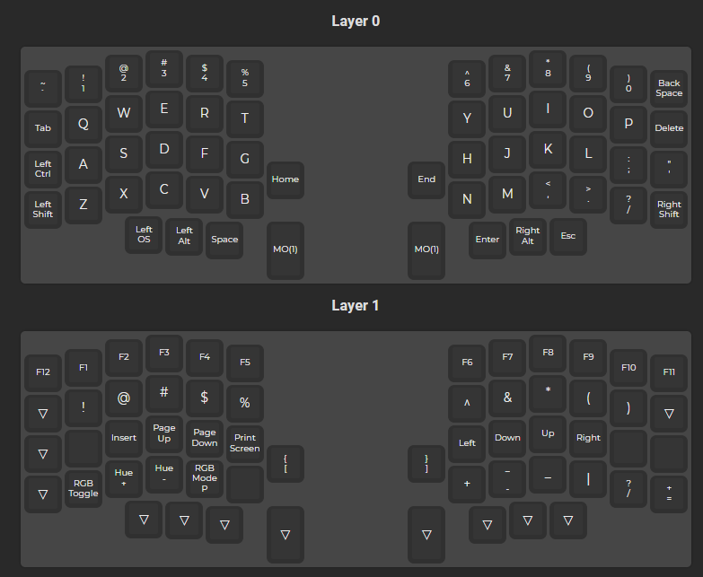

# lily58 rev1

## building

- [keyboard soldering](https://kriscables.com/lily58-build-guide/)
- [led soldering](https://kriscables.com/lily58-rgb-underglow-backlighting/)

## firmware

You can either use the online builder [here](https://config.qmk.fm/#/lily58/rev1/LAYOUT) or you can compile it yourself

Follow [this](https://docs.qmk.fm/#/getting_started_build_tools) guide to install all the necessary stuff you need to compile

You also can keep following the guide as it explain everything perfectly, I'll report below the main steps

- windows folder path: `C:\Users\YOURUSER\qmk_firmware\keyboards\lily58\keymaps\YOURLAYOUT`
- Create a new keymap: `qmk new-keymap -kb lily58/rev1`
- Open the `keymap.c` file and make your edits OR copy the files in this repo into your newly created folder
- Compile it with `qmk compile -kb lily58/rev1 -km <keymap>`
- Once it completes you will have a `.hex` file which can be flashed from command line or by using the QMK Tool

## current layout

